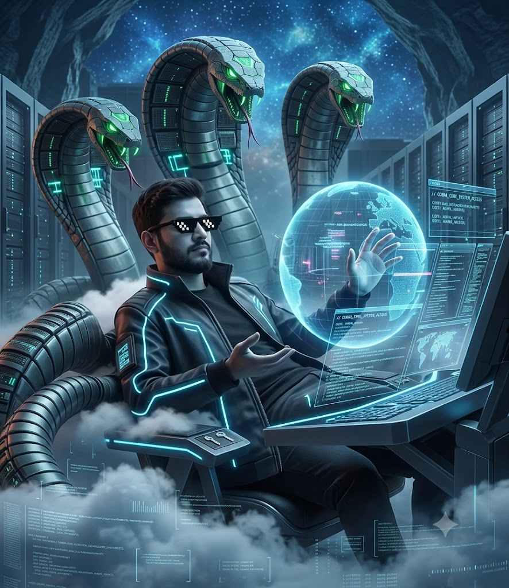

<!-- 
  ╔══════════════════════════════════════════════════════════════╗
  ║          CYBERSOC PROFILE DASHBOARD — MEET KHAMAR           ║
  ║                                                              ║
  ║  This README is a product, not a document.                   ║
  ║  Before editing, consult the documentation suite:            ║
  ║    README_DESIGN_SYSTEM.md  · README_COMPONENTS.md           ║
  ║    README_ANIMATION.md      · README_STYLE_GUIDE.md          ║
  ║    README_CONTENT.md        · README_CONTEXT.md              ║
  ╚══════════════════════════════════════════════════════════════╝
-->

<!-- ═══════════════════ HERO BANNER ═══════════════════ -->

<p align="center">
  
</p>

<!-- ═══════════════════ TERMINAL INIT ═══════════════════ -->

<p align="center">
  
</p>

<br/>

<!-- ═══════════════════ SYSTEM STATUS BAR ═══════════════════ -->

<p align="center">
  
</p>

<!-- ═══════════════════ STATUS BADGES ═══════════════════ -->

<p align="center">
  <a href="#-signal-channel"></a>
  &nbsp;
  <a href="#-signal-channel"></a>
  &nbsp;
  <a href="#-signal-channel"></a>
  &nbsp;
  <a href="#-signal-channel"></a>
</p>

<br/>

<!-- ═══════════════════ SECTION DIVIDER ═══════════════════ -->
<p align="center"></p>

<!-- ═══════════════════ /WHOAMI — OPERATOR IDENTIFICATION ═══════════════════ -->

## ⚡ `/whoami`

<table width="100%">
  <tr>
    <td width="38%" align="center" valign="top">
      <!-- Cyber Operator Portrait -->
      
      <br/><br/>
    </td>
    <td width="62%" valign="top">

```jsonc
// OPERATOR IDENTIFICATION
{
  "name": "MEET KHAMAR",
  "title": "Cyber Security Professional & Automation Engineer",
  "focus": [
    "Blue Teaming",
    "SOC Operations",
    "Incident Response",
    "SecOps Automation"
  ],
  "philosophy": "Why click 10 times when you can write a script to do it forever?",
  "status": "Scanning logs for anomalies & writing pipelines to auto-remediate them."
}
```

```
      .---.          OS: Linux (Kali / Parrot) | Windows Security Engine
     ( - - )         SHELL: Bash | PowerShell 7+ | Python
     \-----/         TARGETS: Threat Hunting, Log Correlation, Automating SecOps
    ==|   |==        SIEMs: Splunk, Wazuh, FortiGate
      |   |          SCRIPTS: Python, PowerShell, Bash, Go
     /     \         MISSION: Reduce MTTR using automation.
    /       \        STATUS: Operational [24*7*365]
```

  </td>
  </tr>
</table>

<br/>

<!-- ═══════════════════ SECTION DIVIDER ═══════════════════ -->
<p align="center"></p>

<!-- ═══════════════════ MISSION BRIEFING ═══════════════════ -->

## 🎯 Current Mission

<p align="center">
  
</p>

<br/>

<!-- ═══════════════════ SECTION DIVIDER ═══════════════════ -->
<p align="center"></p>

<!-- ═══════════════════ SOC ARSENAL ═══════════════════ -->

## 🔬 Security Operations Center — Arsenal

<table align="center" width="100%">
  <tr>
    <td width="50%" valign="top">
      <h3 align="center">🛡️ Defense & Monitoring</h3>
      <p align="center"><sub><i>Blue Team — Continuous Surveillance</i></sub></p>
      <br/>
      <p align="center">
        
        <br/>
        
        
        <br/>
        
        
      </p>
    </td>
    <td width="50%" valign="top">
      <h3 align="center">⚔️ Threat Hunting & Assessment</h3>
      <p align="center"><sub><i>Proactive Threat Detection</i></sub></p>
      <br/>
      <p align="center">
        
        
        <br/>
        
        
        <br/>
        
        
      </p>
    </td>
  </tr>
</table>

<br/>

<!-- ═══════════════════ SECTION DIVIDER ═══════════════════ -->
<p align="center"></p>

<!-- ═══════════════════ SCRIPTING & AUTOMATION ═══════════════════ -->

## 🐍 Scripting & Automation Terminal

> *"The best security operations are those where manual steps are converted to reliable code."*

<div align="center">
  
  
  
  <br/>
  
  
  
</div>

<br/>

### ⚙️ Active Automation Pipeline

<p align="center">
  
</p>

<br/>

- 📂 **Auto-SOC Scripts** — Custom Python scripts to parse `.pcap` files and match IOCs against active threat intel feeds.
- ⚙️ **Windows Event Logger** — PowerShell script to query event IDs `4624` (Successful Logon) and `4625` (Failed Logon) to flag brute-force vectors automatically.

<br/>

<!-- ═══════════════════ SECTION DIVIDER ═══════════════════ -->
<p align="center"></p>

<!-- ═══════════════════ SKILLS RADAR ═══════════════════ -->

## 📡 Operational Capabilities

<p align="center">
  
</p>

<br/>

<!-- ═══════════════════ SECTION DIVIDER ═══════════════════ -->
<p align="center"></p>

<!-- ═══════════════════ GITHUB STATISTICS ═══════════════════ -->

## 📈 Deployment Metrics

<p align="center">
  
  &nbsp;&nbsp;
  
</p>

<p align="center">
  
</p>

<p align="center">
  
</p>

<br/>

<!-- ═══════════════════ SECTION DIVIDER ═══════════════════ -->
<p align="center"></p>

<!-- ═══════════════════ OPERATIONS TIMELINE ═══════════════════ -->

## 🕐 Operations Timeline

<p align="center">
  
</p>

<br/>

<!-- ═══════════════════ SECTION DIVIDER ═══════════════════ -->
<p align="center"></p>

<!-- ═══════════════════ SIGNAL CHANNEL (CONTACT) ═══════════════════ -->

## 📡 Signal Channel

<p align="center">
  <a href="https://github.com/MeetKhamar" target="_blank">
    
  </a>
  &nbsp;&nbsp;
  <a href="mailto:meetkhamar3501@gmail.com" target="_blank">
    
  </a>
  &nbsp;&nbsp;
  <a href="https://www.linkedin.com/in/meet-khamar-a8527330b/" target="_blank">
    
  </a>
</p>

<br/>

<!-- ═══════════════════ FOOTER ═══════════════════ -->

<p align="center">
  
</p>

<p align="center">
  <sub><i>Console session terminated. Stay secure. 🔐</i></sub>
</p>

<p align="center">
  <sub>
    <a href="README_DESIGN_SYSTEM.md">Design System</a> · 
    <a href="README_COMPONENTS.md">Components</a> · 
    <a href="README_ANIMATION.md">Animation</a> · 
    <a href="README_ROADMAP.md">Roadmap</a>
  </sub>
</p>

<!-- 
  Built with purpose. Every pixel intentional.
  Documentation: README_DESIGN_SYSTEM.md | README_COMPONENTS.md | README_ANIMATION.md
  Architecture:  README_CONTEXT.md | README_GENERATION.md
  Content:       README_CONTENT.md | README_STYLE_GUIDE.md
  Future:        README_ROADMAP.md
-->
